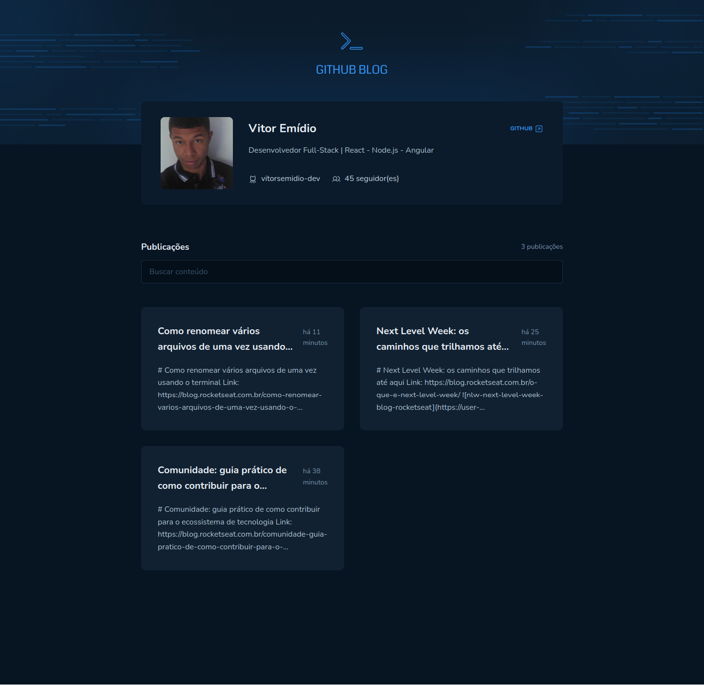
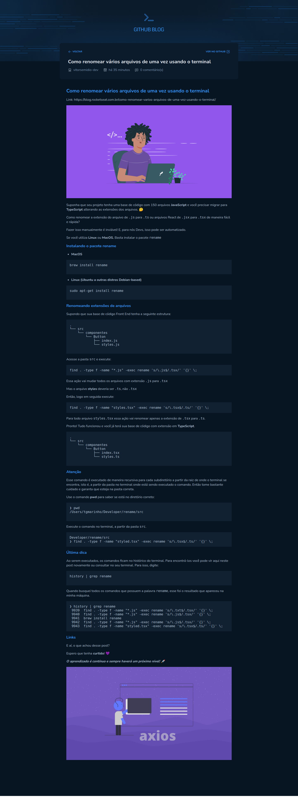
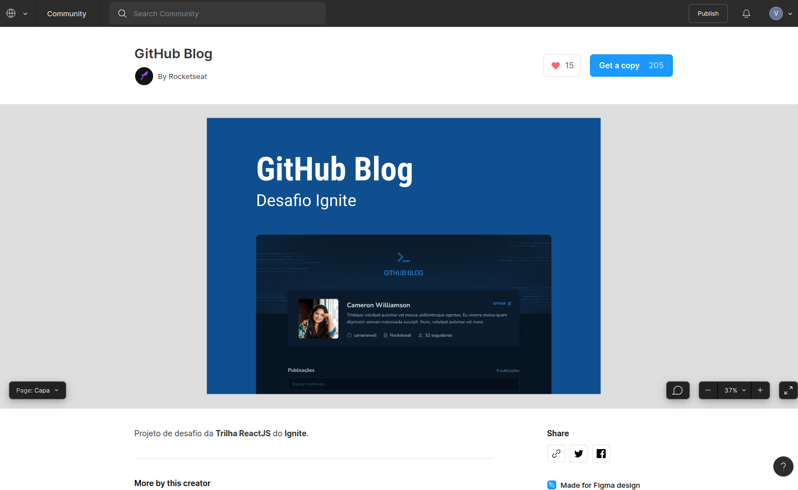

<div align="center">
    
</div>

<div align="center">
    
</div>

<h2 align="center">
   Github Blog | 
</h2>

<p align="center">
  
  
  
  
  
  
  
</p>

---

## 💻 Projeto

Github Blog é uma aplicação que busca as issues de um repositório e lista como se fossem postagens de um blog

**Pesquisa repositórios**

<div align="center">
    
</div>

**Poste específico**

<div align="center">
    
</div>

## 🧭 Como rodar o projeto

**Clone este repositório**

```bash
git clone https://github.com/vitorsemidio-dev/github-blog
```

**Configure as variáveis de ambiente**

- Crie um arquivo `.env` e preencha os valores das variáveis com seu nome e repositório do github. Existe um exemplo em `.env.example`.

```env
VITE_GITHUB_OWNER=""
VITE_GITHUB_REPO=""
```

**Instale as dependências**

```bash
npm install
```

**Rode o projeto DT Money**

```bash
npm run dev
```

- Acesse o front da aplicação em [http://localhost:5173](http://localhost:5173)

## 🔖 Layout

Você pode visualizar o layout do projeto através [desse link](https://www.figma.com/community/file/1138814951106121051). É necessário ter conta no [Figma](https://figma.com) para acessá-lo.



## 🚀 Tecnologias

O projeto foi desenvolvido com as seguintes tecnologias:

- [Axios](https://axios-http.com/)
- [ESLint](https://eslint.org/)
- [Json Server](https://github.com/typicode/json-server)
- [React](https://pt-br.reactjs.org/)
- [React Developer Tools](https://chrome.google.com/webstore/detail/react-developer-tools/fmkadmapgofadopljbjfkapdkoienihi)
- [Rocketseat eslint-config](https://github.com/Rocketseat/eslint-config-rocketseat)
- [Styled Components](https://styled-components.com/)
- [Typescript](https://www.typescriptlang.org/)
- [use-context-selector](https://www.npmjs.com/package/use-context-selector)
- [ViteJS](https://vitejs.dev/)
- [Visual Studio Code](https://code.visualstudio.com/)
